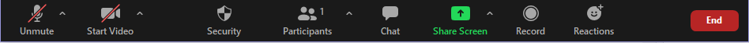
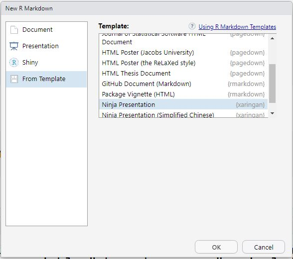
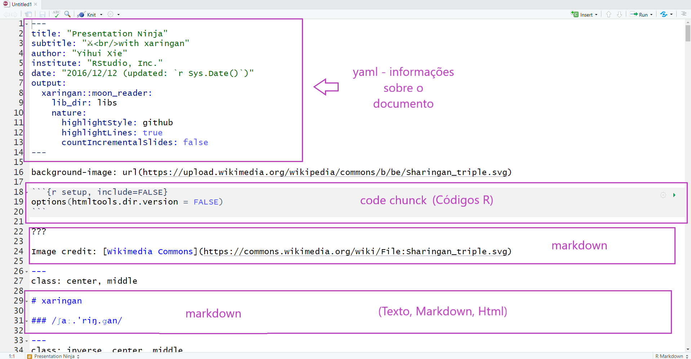
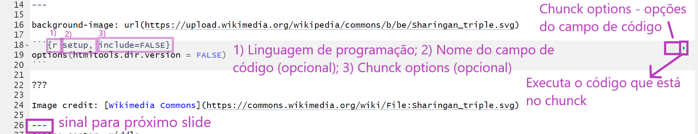
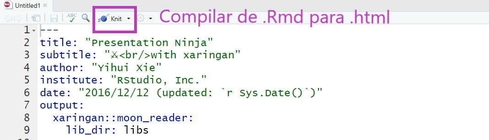

class: center

```{r setup, include=FALSE}
options(htmltools.dir.version = FALSE)

knitr::opts_chunk$set(fig.align = "center",
                      message = FALSE,
                      warning = FALSE,
                      echo = FALSE
                      )
```

```{r xaringan-themer, include=FALSE, warning=FALSE}
library(xaringanthemer)
style_mono_accent(
  base_color = "#23395b",
  header_font_google = google_font("Josefin Sans"),
  text_font_google   = google_font("Montserrat", "300", "300i"),
  code_font_google   = google_font("Fira Mono")
)
```


```{r xaringanExtra, echo=FALSE}
#devtools::install_github("gadenbuie/xaringanExtra")
xaringanExtra::use_xaringan_extra(c("tile_view", "animate_css", "tachyons"))

xaringanExtra::use_editable(expires = 1)

xaringanExtra::use_logo(
  image_url = "img/hex-logo-latinr.png",
  link_url = "https://latin-r.com/pt"
)

xaringanExtra::use_clipboard()

xaringanExtra::use_fit_screen()

xaringanExtra::use_extra_styles(
  hover_code_line = TRUE,         #<<
  mute_unhighlighted_code = FALSE  #<<
)
```


## Workshop oferecido por:

.pull-left[
```{r , out.width="80%"}
knitr::include_graphics("img/hex-logo-latinr.png")
```

[LatinR](https://latin-r.com/pt)
]

.pull-right[
```{r, out.width="80%"}
knitr::include_graphics("https://beatrizmilz.github.io/slidesR/introR/img/rainbow-inclusive.png")
```

[R-Ladies Goiânia](https://www.meetup.com/rladies-goiania/) + <br> [R-Ladies São Paulo](https://www.meetup.com/rladies-sao-paulo/)
]

---
## Olá!

.pull-left[
### Beatriz Milz
- [Instrutora de `tidyverse` certificada pela RStudio](https://education.rstudio.com/trainers/people/milz+beatriz/)
- Co-organizadora: [R-Ladies São Paulo](https://www.meetup.com/R-Ladies-Sao-Paulo/), [satRday São Paulo](https://saopaulo2019.satrdays.org/), [LatinR](https://latin-r.com/pt), [useR! 2021 global](https://user2021.r-project.org/)
- Doutoranda em Ciência Ambiental (IEE/USP)
- Mestre em Ciências (UNIFESP)
- Bacharela em Gestão Ambiental (EACH/USP)
- [Embaixadora de Inovação Cívica da Open Knowledge Brasil](https://embaixadoras.ok.org.br/).
]

.pull-right[
### Haydee Svab

- Co-fundadora e cientista de dados da ASK-AR 
- Trabalhou para: BID, Banco Mundial e Metrô-SP
- Co-fundadora dos grupos **RLadies-São Paulo**, PoliGNU e PoliGen (USP)
- Mestra em Eng. e Planej. de Transportes (Poli-USP)
- Especialista em Democracia Participativa (UFMG)
- Engenheira Civil/Arquiteta (Programa Poli-FAU/USP)
]

---
class: middle

## Combinados:

- Todas as pessoas devem seguir o [código de conduta da conferência LatinR](https://latin-r.com/cdc-pt/).

- Espaço acolhedor e amigável `r emo::ji("hugs")`

- O evento será gravado. Caso não queira aparecer na gravação, pedimos que desligue sua câmera.

- Escreva suas dúvidas no chat.

- Mantenha seu microfone desligado. 

```{r, out.width="100%"}

```
---

class: 

# Pré-requisitos

## No seu computador

- R: faça o download da versão mais recente [neste link](https://cran.r-project.org/).

- RStudio: faça o download da versão mais recente [neste link](https://www.rstudio.com/products/rstudio/download/).

- Instale os seguintes pacotes:


```{r echo=TRUE, eval=FALSE}
install.packages("xaringan")
install.packages("xaringanthemer")
install.packages("pagedown")
```


---
class: inverse, center, middle

# Relatórios Reprodutíveis em R


---
class: 

## O ciclo da ciência de dados

```{r, out.width="90%", fig.cap="<center><b>Ilustração por Allison Horst - Twitter: <a href='https://twitter.com/allison_horst/'> @allison_horst</a> - Adaptado de Wickham e Grolemund, 2017</b></center>"}
knitr::include_graphics("img/data-analysis.jpg")
```


---
class: 

## Pacote R Markdown


.pull-left[

- Mantido pela [RStudio](https://rstudio.com/)

- Arquivos com extensão `.Rmd`

- Possibilita a utilização de códigos:
  - `R`
  - `Markdown`
  - `HTML`
  - e outros
]

.pull-right[
```{r, out.width="75%", fig.cap="<center><b>Logo: <a href='https://rmarkdown.rstudio.com'>Pacote `rmarkdown`</a></b></center>"}
knitr::include_graphics("img/hex-rmarkdown.png")
```
]


---
class:  

## R Markdown

```{r, out.width="45%", fig.cap="<center><b>Fonte: <a href='https://rmarkdown.rstudio.com'>Pacote `rmarkdown`</a></b></center>"}
knitr::include_graphics("img/markdown.png")
```


---
class: inverse, center, middle

# Apresentações com R Markdown


---
class: 

## Pacote xaringan

.pull-left[

- Possibilita criar apresentações **ninjas** com `R Markdown`

- Utiliza a biblioteca `remark.js`

- Gera resultado em HTML 

- HTML pode ser convertido para PDF (estático)
]

.pull-right[

```{r, out.width="75%", fig.cap="<center><b>Logo: <a href='https://github.com/yihui/xaringan'>Pacote xaringan</a></b></center>"}
knitr::include_graphics("img/hex-xaringan.png")
```

]

---
class: 

## Estrutura da apresentação

- No `xaringan`, utilizamos o arquivo `.Rmd` para escrever o código da apresentação que é compilado para um arquivo `.html`

- Esse arquivo `.html` é interpretado pelo navegador (ex. Chrome), utilizando também os arquivos `.css` e `.js`


```{r echo=FALSE, out.width="50%", eval = TRUE}
knitr::include_graphics("img/html-css-javascript.jpg")
```


---
class: 

## Estrutura da apresentação

```{r echo=FALSE, out.width="40%", eval = TRUE}
knitr::include_graphics("img/html-css-javascript.jpg")
```

  - **HTML** (HyperText Markup Language - Linguagem de Marcação de Hipertexto): é uma linguagem de marcação, é usado para estruturar a página.

  - **CSS** (Cascading Style Sheets - Folha de Estilo em Cascata): é usado para estilizar os elementos escritos no HTML.

  - **Javascript**: é uma linguagem de programação, permite que as páginas sejam dinâmicas.

---
class: 

## O que precisa saber? 

- **HTML**: É gerado automaticamente ao compilar o `.Rmd`

- **CSS**: É usado para personalizar a parte visual da apresentação. Para saber mais sobre temas: [xaringan wiki](https://github.com/yihui/xaringan/wiki/Themes)

- **JS**: utiliza o `Remark.JS`, mas aceita outros códigos caso seja necessário.

```{r, out.width="20%"}
knitr::include_graphics("https://media1.giphy.com/media/VbnUQpnihPSIgIXuZv/giphy-downsized.gif")
```


---
class:  

## Recomendações #1

- Desenvolva a apresentação em um projeto no RStudio: <br>
facilita muito para organizar os arquivos e posteriormente sincronizar com o GitHub.

  - `File > New Project > New Directory > New Project`
  
  - Dê um nome para seu projeto (será o nome da pasta)
  
  - Escolha a pasta no seu computador
  
  - Clique em `Create Project`

---
class:  

## Recomendações #2

- Organize o seu diretório. <bbr>
Por exemplo:

  - `img/` - imagens, figuras, etc.
  
  - `libs/` - bibliotecas. 
  
  - `css/` - para arquivos `.css` (opcional)
  
- `r emo::ji("bell")` **Importante**: Compile (knit) o arquivo com frequência!  

---
class: 

## Criar um arquivo R Markdown

### Com template Ninja Presentation

  - `File > New File > R Markdown...`
  
  - Na janela New R Markdown: <br> `From Template > Ninja Presentation`
  
```{r, out.width="50%"}

```

---
class:  

## Estrutura arquivo R Markdown

```{r, out.width="90%"}

```

---
class: 

## Como delimitar slides?

- No xaringan, os slides são delimitados por `---` no início da linha.

- Para fazer slides que aparecem aos poucos ( _incremental slides_ ), utilize `--` no início da linha.
<br>
<br>
Por exemplo:

--

O conteúdo 
--

aparece 
--

aos poucos!

---
class: inverse, center, middle

# Apresentações com R Markdown


Demonstração de código `r emo::ji("woman_technologist")`

---
class: 

## `r emo::ji("woman_technologist")` Exercícios 

1. Crie um projeto `.Rproj`

2. Crie um arquivo R Markdown com o template `Ninja presentation`

3. Apague o conteúdo após o `YAML` (linha 15 em diante)

4. Aperte `Knit` e veja o resultado

5. No tempo restante: <br>
Dica: [Relembre como fazer no tutorial enviado](https://beatriz-milz.shinyapps.io/tutorial_markdown/)

  - Adicione um slide com a seguinte frase (com as formatações e links como aparecem aqui!):  
  
  > [R-Ladies](https://rladies.org/) é uma organização que promove a __diversidade de gênero__ na comunidade da linguagem `R`.


---


# Chunk de código

Para inserir um chunk, ou campo de código

- O chunk deve ***iniciar e terminar*** por uma série de 3 crases ` ``` `

- O chunk deve iniciar fornecendo os parâmetro entre `{}` <br>
Se quiser ver o código e o resultado use echo = TRUE, <br>
se quiser ver apenas o resultado use echo = FALSE.

```{r, out.width="100%"}

```

---
class: 

## `r emo::ji("woman_technologist")` Exercícios  

6. Adicione uma tabela a partir de um `data frame` <br>
  (Você pode usar `mtcars`, por exemplo)
  
7. Adicione uma imagem na sua apresentação <br>
  (Dica: crie uma pasta `img`, salve a imagem nesta pasta)
  
8. Inclua um chunk de código em que a variável x recebe o valor 4, a variável y recebe o valor 6 e calcula a soma de x e y.

Dica: Se precisar, [consulte o tutorial enviado](https://beatriz-milz.shinyapps.io/tutorial_markdown/)

--

```{r, echo = TRUE}
x <-4
y <- 6
x + y
```

---
class: inverse, center, middle

# Metadados da apresentação: `YAML`


---
class:  

## Alterar `YAML`

- O `YAML` possui informações importantes para a <br> apresentação como:
  - título;
  - subtítulo;
  - autor;
  - instituição;
  - data;
  - etc.

- __output:__ indica o formato, por exemplo html_document, pdf_document, etc.
No caso do  `xaringan`, o output é `xaringan::moon_reader`

- __libs_dir:__ pasta onde colocará bibliotecas necessárias. <br>
Por exemplo: `lib_dir: libs` indica que a biblioteca que usamos remark-latest.min.js será salva na pasta libs.
    
---

## Alterar `YAML`

- Cuidado com a identação!

```{r}
knitr::include_graphics("https://media0.giphy.com/media/xT9IgIc0lryrxvqVGM/giphy-downsized.gif")
``` 


---
class: 

## Exemplo do código `YAML`:

```{r echo=TRUE, eval=FALSE}
---
{{title: "Título da apresentação"}}
{{subtitle: "Subtítulo da apresentação"}}
{{author: "Autor"}}
{{institute: "Instituição"}}
{{date: "07/09/2019"}}
output:
  xaringan::moon_reader:
    lib_dir: libs
    nature:
      highlightStyle: github
      highlightLines: true
      countIncrementalSlides: false
---
```

- Aperte H ou ? para conferir a lista de atalhos do  `xaringan`


---
class: 

## Encoding

- Adicionar no `YAML`:

```{r echo=TRUE, eval=FALSE}
encoding: "UTF-8"
```

"Uma **codificação de caracteres** é um padrão de relacionamento entre um conjunto de caracteres(...) com um conjunto de outra coisa, como por exemplo números ou pulsos elétricos com o objetivo de **facilitar o armazenamento de texto em computadores e sua transmissão** através de redes de telecomunicação." <br>
[Wikipedia](https://pt.wikipedia.org/wiki/Codificação_de_caracteres)

<!--"There Ain’t No Such Thing As Plain Text." <br>
[Joel Spolsky, 2003](https://www.joelonsoftware.com/2003/10/08/the-absolute-minimum-every-software-developer-absolutely-positively-must-know-about-unicode-and-character-sets-no-excuses/)
 If you have a string, in memory, in a file, or in an email message, you have to know what encoding it is in or you cannot interpret it or display it to users correctly." -->

---
class: 

## Biblioteca `remark.js`

- Seu uso é opcional, mas recomendado! <br>
Possibilita que sua apresentação seja **visualizada offline**!


- Duas opções para fazer download da biblioteca `remark.js`:
<br><br>
  - A função `xaringan::summon_remark()` faz o download da versão mais atual do `remark.js` e salva na pasta `/libs`
<br><br>
  - Usando a função `download.file` indicando como primeiro parâmetro a url de origem, bem como o destino como parâmetro do *destfile*
  
---
class: 

## Biblioteca `remark.js`  
  
```{r echo=TRUE, eval=FALSE}
xaringan::summon_remark()

# Ou:

download.file("https://remarkjs.com/downloads/remark-latest.min.js",
              destfile = "libs/remark-latest.min.js")
```
--
- Adicionar no `YAML`:

```{r echo=TRUE, eval=FALSE}
output:
  xaringan::moon_reader:
{{    chakra: libs/remark-latest.min.js  }}
    lib_dir: libs
```

---
class: 

## Adicionando conteúdo na apresentação

- Atualiza a apresentação enquanto é editada:

```{r echo=TRUE, eval=FALSE}
xaringan::inf_mr()
```


---
class: inverse, center, middle

# Estilo (`.css`)


---
class: 

## Estilo (`.css`)

- Possibilidades:

  - Temas do xaringan
  
  - Temas com [`{xaringanthemer}`](https://pkg.garrickadenbuie.com/xaringanthemer/)
  
  - Alterando o `.css`: arquivo `custom.css`

---
class: 

### Tema

- Depende da versão do `xaringan` que está usando.

- Para consultar os temas disponíveis:
  
```{r echo=TRUE}
names(xaringan:::list_css())
```


---
class: 

### Tema


- `r emo::ji("bell")` Dica: <br>
Usar em dupla: `nomedotema` e `nomedotema-fonts`

- Adicionar no `YAML`:

```{r echo=TRUE, eval=FALSE}
output:
  xaringan::moon_reader:
{{    css: ["rladies", "rladies-fonts"]}}
```


---
class: 

### Exemplo do código `YAML`:

```{r echo=TRUE, eval=FALSE}
---
title: "Título da apresentação"
subtitle: "Subtítulo da apresentação"
author: "Autor"
institute: "Instituição"
date: "07/09/2019"
encoding: "UTF-8"
output:
  xaringan::moon_reader:
{{   chakra: libs/remark-latest.min.js  }}
{{   css: ["rladies", "rladies-fonts"]}}
    lib_dir: libs
    nature:
      highlightStyle: github
      highlightLines: true
      countIncrementalSlides: false
---
```

---
class: 

### xaringanthemer

- Cria o arquivo `.css`!

- Duas possibilidades para usar:

  - Criar um arquivo com template  `Ninja **themed** presentation`

  - Usar em uma apresentação que já existe: [veja aqui](https://pkg.garrickadenbuie.com/xaringanthemer/#quick-intro)
    

---
class: inverse, center, middle

# Compartilhando a apresentação

---
Class: 

## PDF

- Para compartilhar em PDF, é possível converter o HTML em PDF com a função `pagedown::chrome_print()`:

```{r echo=TRUE, eval=FALSE}
remotes::install_github('rstudio/pagedown')
pagedown::chrome_print("index.html")
```

---
Class: 


## Página web

- HTML - Pode disponibilizar online :)

  - Em seu site;

  - [GitHub Pages](https://pages.github.com/) 
  - [Netlify](https://www.netlify.com/) 

```{r, out.width="80%"}

```

- Dica: crie um [bit.ly](https://bitly.com)


---

## Outros pacotes

### Aumentando as possibilidades!

- [pagedown](https://github.com/rstudio/pagedown) - `r emo::ji("heavy_check_mark")` CRAN, `r emo::ji("heavy_check_mark")` GitHub

- [xaringanthemer](https://pkg.garrickadenbuie.com/xaringanthemer/) - `r emo::ji("heavy_check_mark")` CRAN, `r emo::ji("heavy_check_mark")` GitHub

- [giphyr](https://github.com/haozhu233/giphyr) - `r emo::ji("heavy_check_mark")` CRAN, `r emo::ji("heavy_check_mark")` GitHub

- [metathis](https://pkg.garrickadenbuie.com/metathis/) - `r emo::ji("heavy_check_mark")` CRAN, `r emo::ji("heavy_check_mark")` GitHub
 
- [xaringanExtra](https://pkg.garrickadenbuie.com/xaringanExtra/) - `r emo::ji("x")` CRAN, `r emo::ji("heavy_check_mark")` GitHub
 
- [countdown](https://pkg.garrickadenbuie.com/countdown/#1) - `r emo::ji("x")` CRAN, `r emo::ji("heavy_check_mark")` GitHub
 
- [emo](https://github.com/hadley/emo) + [ermoji](https://www.garrickadenbuie.com/project/ermoji/)  - `r emo::ji("x")` CRAN, `r emo::ji("heavy_check_mark")` GitHub


---
class: middle, center

```{r, out.width="50%", fig.cap="<center><b>Ilustração por Allison Horst - Twitter: <a href='https://twitter.com/allison_horst/'> @allison_horst</a> </b></center>"}
knitr::include_graphics("img/community1.jpg")
```

---
class: 

# Referências

## **R Markdown**:
  - [R Markdown Cheatsheet](https://www.rstudio.com/wp-content/uploads/2015/02/rmarkdown-cheatsheet.pdf)
  
  - [R Markdown from RStudio](https://rmarkdown.rstudio.com/lesson-1.html)
  
  - [R Markdown: The Definitive Guide](https://bookdown.org/yihui/rmarkdown/)
  
  - [R for Data Science - Cap 27: R Markdown](https://r4ds.had.co.nz/r-markdown.html)
  
  - [Software Carpentry - Producing Reports With knitr ](https://swcarpentry.github.io/r-novice-gapminder/15-knitr-markdown/)

  - [Advanced R Markdown](https://slides.yihui.name/2017-rstudio-conf-rmarkdown-Yihui-Xie.html)


---
class: 

# Referências

## **xaringan**:

  - [Apresentação da documentação](http://slides.yihui.name/xaringan/) 

  - [xaringan Wiki](https://github.com/yihui/xaringan/wiki)
  
  - [Livro R Markdown (Capítulo 7)](https://bookdown.org/yihui/rmarkdown/xaringan.html)

  - [Remark.js Wiki](https://github.com/gnab/remark/wiki)
 
